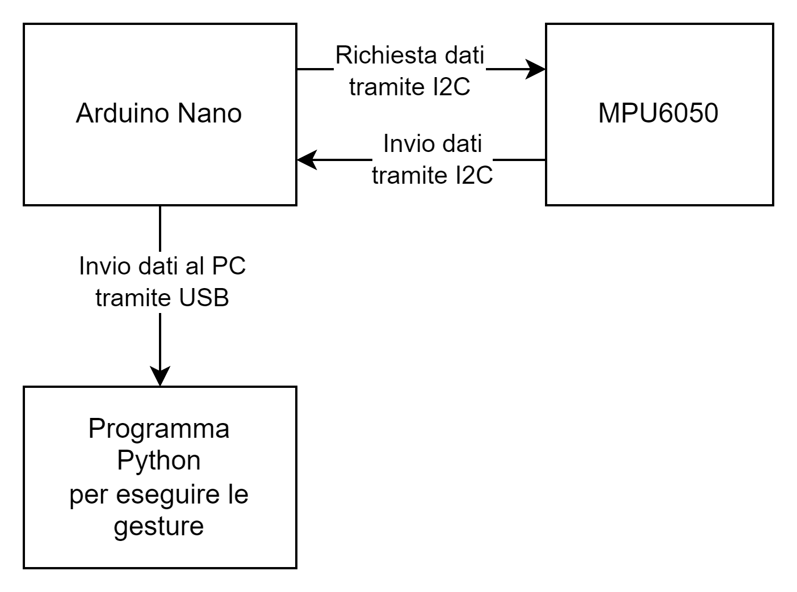

# Progetto

Realizzare un programma che legge dati dal MCU 6050 interfacciandosi direttamente (senza usare librerie specifiche) tramite interfaccia I2C ed utilizzarli per controllare delle gesture specifiche sudi un dispositivo Windows.

## Codice e simulazione:

La simulazione del dispositivo si trovano su Wokwi a questo indirizzo:

[Progetto (Arduino Nano) - Wokwi ESP32, STM32, Arduino Simulator](https://wokwi.com/projects/365074812174370817)

La documentazione è disponibile qui:
[Documentazione Progetto](https://docs.google.com/document/d/1uKXHMNDFY4r9LMBLBaQtqkViEbYkbq694CxanqiLB5s/edit?usp=sharing)

# Analisi del problema:

Il dispositivo dovrà essere in grado di leggere i dati del giroscopio (utilizzando un interrupt per la lettura) e di inviarli tramite interfaccia seriale USB ad un computer dove uno script Python eseguirà le gesture.

